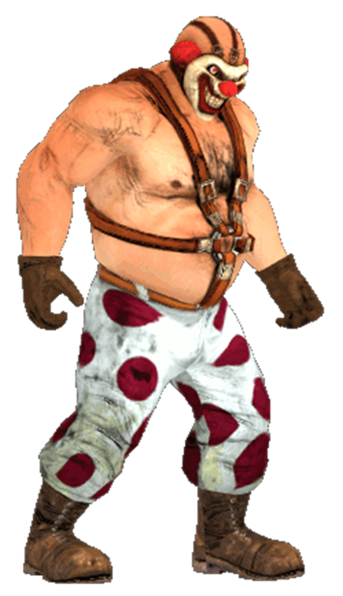

# Sweet Tooth (Twisted Metal)

---

## Información

- **Personaje:** Sweet Tooth (Needles Kane)  
- **Origen:** Saga *Twisted Metal*  
- **Autor original del personaje:** Varia31  
- **Fecha de creación original:** 02/08/2016  
- **Modificaciones por:** Mugen's World  

---

## Descripción

Este proyecto corresponde a una **versión modificada del personaje Sweet Tooth para MUGEN**, originalmente creado por **Varia31**.

El personaje original ya es **100% jugable**, incluyendo animaciones, movimientos y mecánicas de combate completas.

Las modificaciones realizadas en este proyecto están enfocadas principalmente en **mejoras visuales y efectos estéticos**, manteniendo intacta la base jugable del personaje.

---

## Modificaciones realizadas

Las modificaciones incluyen principalmente mejoras visuales, tales como:

- Creación de **sprites nuevos para las llamas en la cabeza**
- Integración de **efectos de fuego en la cabeza del personaje**
- Modificación de **animaciones existentes**
- Ajustes y ampliación de sprites

Las llamas fueron añadidas a las siguientes animaciones:

- Stand
- Agachado
- Movimiento hacia adelante
- Intro del personaje

---

## Créditos

**Autor original del personaje**

- Varia31  
- Fecha original: 02/08/2016

**Modificaciones estéticas**

- Mugen's World

---

## Estado del proyecto

✔ Personaje completamente jugable (versión original)  
🔧 Modificaciones visuales en progreso  

Actualmente el proyecto se centra en **mejoras estéticas** del personaje.

Es posible que en el futuro se añadan **efectos de fuego en más animaciones**.

---

## Video

Demostración del personaje en MUGEN:

---

## Filosofía del proyecto

Este proyecto sigue el espíritu de la comunidad **MUGEN**:

> MUGEN es de la comunidad para la comunidad.

---

## Uso y distribución

El crédito del personaje pertenece a su **autor original Varia31**.

Esta versión modificada es una **edición estética** del trabajo original.

Se permite:

- Usar el personaje
- Modificarlo
- Crear versiones derivadas

Siempre respetando el crédito del autor original.
